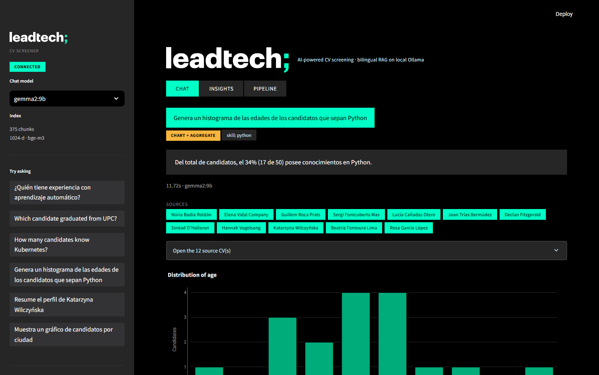
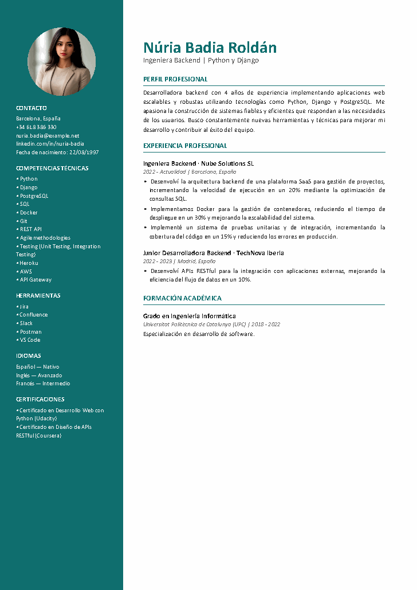
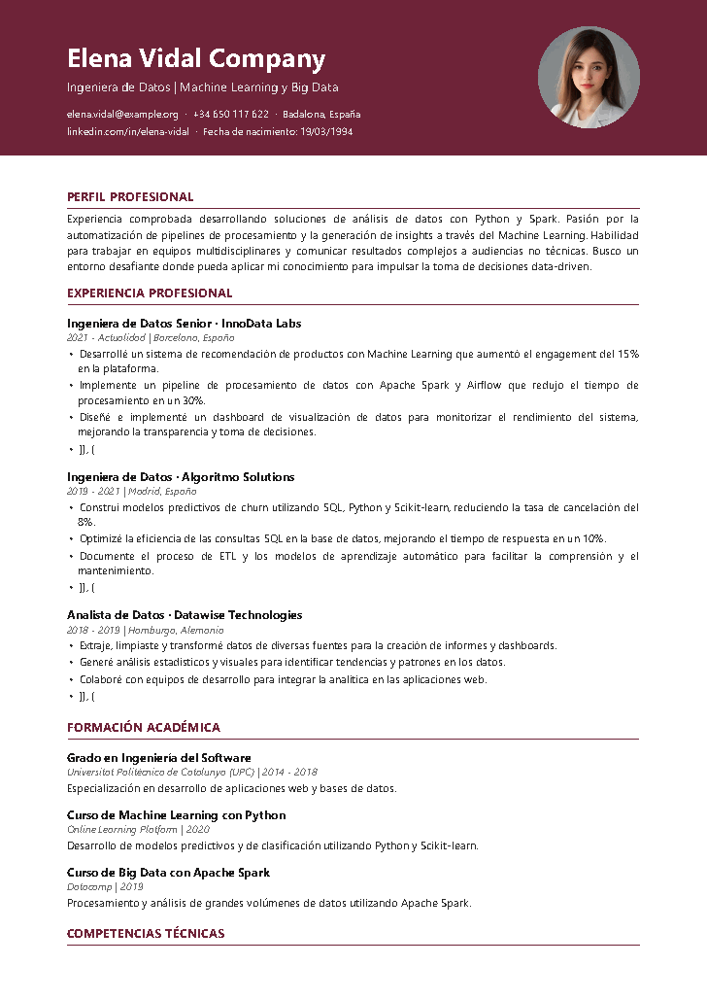
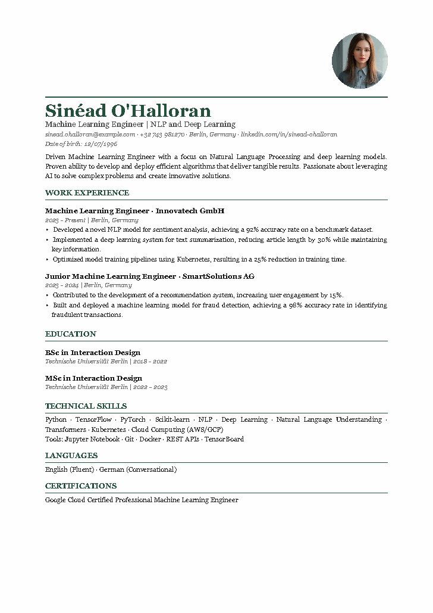
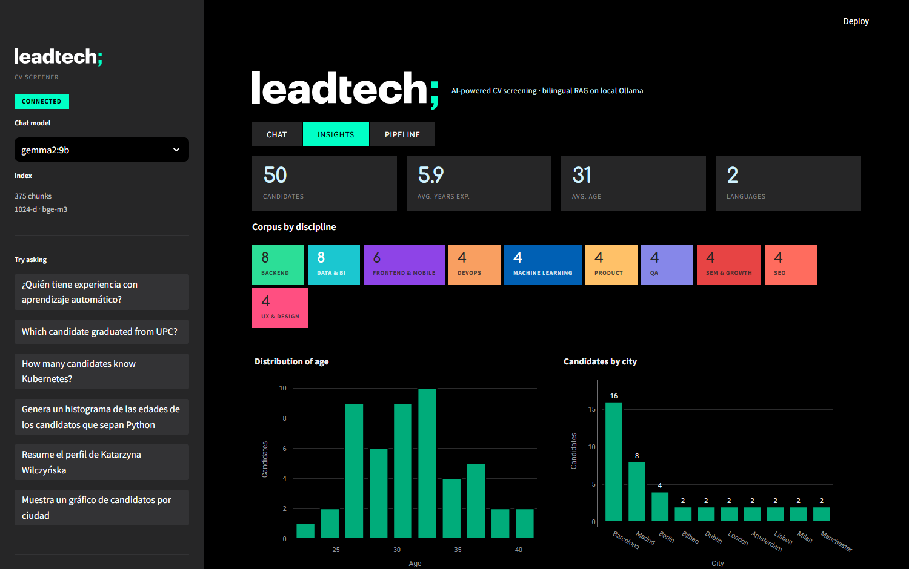

# LeadTech · AI-Powered CV Screener

A bilingual (ES/EN) RAG system over a corpus of 50 synthetic CVs, running
**entirely on local models via Ollama** — no API keys, no cloud inference.

Ask in Spanish, get answers grounded in English CVs. Ask for a count, get an
exact figure computed over all 50 candidates rather than a guess from five
retrieved chunks. Ask for a histogram, get one.



---

## What it does

| | |
|---|---|
| **Generate** | 50 unique fake CVs as PDFs — LLM-authored text, AI-generated headshots, 3 layouts, 25 Spanish + 25 English |
| **Ingest** | Column-aware PDF extraction → section chunking → structured facts → dense + lexical index |
| **Ask** | Routed queries: semantic retrieval, exact aggregates, or on-demand charts — all streamed, all cited |

---

## Quick start

Requires **Python 3.11+**, **[Ollama](https://ollama.com)**, and ~8 GB of disk for the models.

```bash
ollama pull gemma2:9b        # chat, routing, fact extraction
ollama pull bge-m3           # multilingual embeddings

python -m venv venv
.\venv\Scripts\python.exe -m pip install -r requirements.txt
.\venv\Scripts\python.exe -m pip install -e .
copy .env.example .env
```

The repository already ships the generated corpus and index, so you can go
straight to:

```powershell
.\run.ps1          # starts FastAPI (:8000) and Streamlit (:8501)
```

To rebuild everything from scratch:

```bash
python -m cvscreener.generation.pipeline   # 50 CVs   (~40 min)
python -m cvscreener.ingest.index          # search index (~20 min)
pytest                                     # 33 tests
```

Both pipelines are **resumable** — each stage caches its artefact and is skipped
when it already exists, so fixing the renderer costs seconds rather than another
full generation run.

---

## Architecture

Full diagram and rationale: **[docs/architecture.md](docs/architecture.md)**

```
Generation   persona matrix → gemma2:9b (JSON Schema) → ReportLab ⟶ 50 PDFs
                            → pollinations.ai (flux)  ↗

Ingestion    PDF → pdfplumber (column-aware) → section chunks
                 → gemma2:9b + regex ⟶ candidates.parquet
                 → bge-m3            ⟶ 375 × 1024 vectors + BM25

Query        question → router ┬─ retrieve  → dense ⊕ BM25 → RRF → grounded answer
                              ├─ aggregate → pandas over all 50 → exact count
                              └─ chart     → pandas → Plotly
```

### Three things worth pointing at

**1 · The router exists because top-*k* cannot count.**
"Who knows Kubernetes?" is a retrieval question. "*How many* candidates know
Kubernetes?" is not — with `k=5`, the correct answer is unreachable by
construction, however good the retriever. So a schema-constrained classifier
sends counting and charting questions to pandas over the full candidate table
instead. Exact counts verified against the source data, not estimated.

**2 · Metadata is re-derived from the PDFs, never reused from the generator.**
`data/profiles/*.json` holds exactly the structured data the ingestion step
wants. It is never read. Everything is re-extracted from text pulled back out of
the PDFs, so the pipeline is doing the real job — reading documents — rather
than round-tripping its own JSON.

**3 · Hybrid retrieval had a bilingual failure mode, and fixing it needed measurement.**
See below.

---

## The most interesting bug

Hybrid retrieval fuses a dense retriever with BM25 using Reciprocal Rank Fusion,
which rewards documents appearing in *both* rankings. In a bilingual corpus that
quietly breaks:

```
Spanish query → BM25 scores:  { es: 56 non-zero,  en: 0 }
```

A lexical retriever **cannot match across a language boundary**. So an English
chunk can only ever collect rank mass from one of the two retrievers — it is
structurally capped at roughly half the fused score of a Spanish chunk, no
matter how relevant it is.

This suppressed correct answers. For *"¿Qué candidato se dedica al diseño de
producto y accesibilidad?"*:

| Chunk | Dense similarity | In results? |
|---|---|---|
| **Rasmus Lindqvist** (EN, Product Designer) | **0.5183** — best in the entire index | ❌ no |
| Adrián Quesada (ES) | 0.4667 (0.90 of best) | ✅ yes |
| Marta Sanchis (ES) | 0.4597 (0.89 of best) | ✅ yes |

The best match in the corpus was losing to two weaker ones because of a scoring
artefact.

**The fix** reserves final slots for other-language chunks whose *dense*
similarity stands on its own — at least 0.90 of the best in the index. The
threshold is relative and stays within a single metric, so it never blends the
two incomparable score scales that RRF was chosen to avoid. Three regression
tests pin the behaviour.

**What that threshold does not do.** It is a fairness gate, not a relevance
filter. Because the ratio is relative within one query, an off-topic question
produces ratios just as high as a good one — when nothing is relevant, both
languages are equally irrelevant:

| Query | Best EN / best overall | Top absolute score |
|---|---|---|
| *¿Quién sabe posicionamiento en buscadores?* | 0.937 | 0.528 |
| *¿Quién ha trabajado con almacenes de datos…?* | 0.988 | 0.533 |
| *recetas de paella valenciana con conejo* | 0.910 | **0.392** |
| *¿Quién sabe pilotar un helicóptero de rescate?* | 1.000 | **0.402** |

The signal that separates them is the *absolute* score (≈0.49+ vs ≈0.40−), not
the ratio. No absolute floor is applied, because a retriever returning its
top-*k* is correct behaviour — **declining to answer is the generator's job**.

There is, deliberately, no off-topic detector anywhere in the system. An
irrelevant question takes exactly the same path as any other: the router sends
it to `retrieve`, five chunks come back, and the grounding prompt is what makes
the model say the CVs do not contain the answer. Asked about paella, it does.

Four tests cover this, and they assert that **no candidate is named** in the
answer rather than looking for refusal wording. An earlier version did match on
phrases — and understood only Spanish, so it scored a perfectly good English
refusal ("None of the provided CV excerpts mention…") as a failure. Attributing
something to a candidate who never claimed it is the actual risk; how the
refusal is worded is not.

---

## The second bug: semantic search is too forgiving

Asked *"¿Qué candidatos tienen conocimientos en CNN?"* — a term appearing in
**zero** CVs — the system answered:

> *"Guillem Roca Prats: menciona Computer Vision. Las CNN son una arquitectura
> comúnmente utilizada en Computer Vision."*

Nothing there is false, but the headline attributes a skill to someone who
never listed it. And it was inconsistent: the identical question in English was
refused correctly, so whether the user got warned depended on the language they
typed in.

This is the flip side of the earlier bug. Dense retrieval is *supposed* to match
meaning over characters — "CNN" and "computer vision" genuinely are close in
embedding space, and the retriever did its job. But a recruiter typing a
specific technology means that technology, and a semantic neighbourhood is not
a substitute for the CV saying so.

**The fix** ([`rag/keywords.py`](src/cvscreener/rag/keywords.py)) extracts the
terms a user expects to be matched literally — acronyms, tech tokens like
`node.js`, and the skill the router identified — and checks them against the
corpus vocabulary, built with the same tokenizer BM25 uses. Terms found nowhere
are named in the prompt as absent, and shown in the UI as an amber chip.

The check runs against **all 375 chunks**, not the five retrieved. "Absent from
what we retrieved" is weak and might just mean poor ranking; "absent from the
entire corpus" is a fact worth telling the user. Now both languages answer:

> *"CNN no aparece en ninguno de los CVs de la base de datos."* — then offers
> adjacent profiles, explicitly flagged as a suggestion rather than a finding.

Eleven tests cover it, asserting both directions: `CNN` and `COBOL` are flagged,
while `SQL`, `UPC`, `Kubernetes`, `Node.js` and `aprendizaje automático` are not.
The second half matters as much as the first — a check that fires on everything
is a check nobody reads.

*Known gap:* detection catches acronyms, punctuated tech tokens and the router's
single `skill` field. A plain Titlecase technology in a multi-term question
("COBOL **and Fortran**") may slip through, since `QueryPlan` carries one skill.

---

## Engineering decisions

| Decision | Why |
|---|---|
| **numpy, not a vector DB** | 375 vectors (chunks). Exact cosine is one matmul, sub-millisecond. An ANN index would be slower, approximate, and another dependency. |
| **gemma2:9b, not gemma4:12b** | Profiled on this 8 GB RTX 4070 Laptop: the 12B gets only 4.4 GB onto the GPU and runs the rest on CPU → **7.3 tok/s**. The 9B fits entirely → **18.3 tok/s**. 2.5× faster for comparable quality once prompts were tightened. |
| **bge-m3 embeddings** | Genuinely multilingual — one index serves both languages, no translation step. |
| **RRF, not weighted scores** | Measured: bge-m3 scores unrelated text at 0.475 and relevant text at 0.580. A high floor and a narrow band, against unbounded corpus-dependent BM25 scores. Rank-based fusion needs no constants that would break on a different corpus. |
| **Constrained decoding** | Ollama enforces the JSON Schema, so there is no output parsing or JSON-repair code anywhere. It also has a sharp edge — see *The cost of a guarantee* below. |
| **Few-shot in the router** | Schema fixes shape, not meaning. Zero-shot, gemma2 classified *"genera un histograma…"* as `retrieve`. The examples fixed it. |
| **Regex + LLM extraction** | E-mail, phone and date of birth have rigid forms; `re` handles them exactly and instantly. The LLM only does what needs judgement. |
| **Concurrent route + embed** | Independent, both models resident in VRAM. Overlapping halves time-to-first-token: ~13 s → ~7 s. |
| **ReportLab, not HTML→PDF** | Pure-Python wheels. No Chrome or GTK for a reviewer to install. |

### The cost of a guarantee

Constrained decoding is sold as free correctness: the schema is enforced, so the
output is always valid and no parsing code is needed. Both halves are true here.
The part that is not advertised is what happens when the *right* answer is not in
the schema.

`QueryPlan.dimension` is a `Literal` — an enum in the emitted JSON Schema. Ask
*"make me a pie chart of the candidates by gender"* and the model cannot answer
`gender`: it is not a legal token, and the decoder never gets to consider it. It
renormalises over the values that are legal and returns the nearest one. No
exception, no malformed JSON, no low-confidence score. Measured on this corpus:

| Question | Emitted dimension |
|---|---|
| *Make me a pie chart of the candidates by gender* | `cv_language` |
| *Genera un diagrama sectorial por género de los candidatos* | `seniority` |

Both produced a correct text answer beside a confident, well-formed, completely
wrong chart — and the two disagreed with each other, which is the only reason it
was noticeable at all. The failure mode is worse than a crash: nothing about the
figure says it is not what was asked for.

The fix does not try to make the model better at this. Enum members and a
few-shot example were added so `unsupported` is at least *expressible*, but that
is a hint, not a guarantee — a constrained decoder can always pick a
legal-and-wrong value. The guarantee is a deterministic check: after routing,
the chosen dimension must be supported by a word the user actually wrote
(`dimension_supported_by` in [`rag/router.py`](src/cvscreener/rag/router.py)). If
it is not, the chart is withheld and the answer opens by saying the field is not
in the database.

This is the same shape as [the CNN keyword fix](#the-second-bug-semantic-search-is-too-forgiving): the model's output
is checked against the literal question, because a model that cannot express
"I don't know" will always express something else. Tests cover both directions —
eight legitimate chart questions must still be accepted, and four absent fields
must match none of the eight legal dimensions.

Fixing the chart exposed the mirror image of the same bug. With the figure now
correct, the *prose* beside it was invented: asked to split 50 candidates by
seniority, gemma2 reported 40 % Junior / 50 % Mid-level / 10 % Senior against a
true 20 / 28 / 52 — near enough to inverted. The cause was that a chart question
handed the model only *"there are 50 candidates"* plus a table silently
truncated to 40 rows, and asked it to describe a distribution. So it counted the
rows. The chart payload already held exact counts, so those are now passed in as
a computed fact and the truncation announces itself — the same rule the count
already followed: **the model phrases arithmetic, it never performs it.**

**Why not just add gender to the table?** Because the pipeline re-derives every
fact from the extracted PDF text and never reads the generation metadata, which
is what makes the RAG honest. Gender is not stated on these CVs. The only ways
to obtain it are to break that boundary or to infer it from names and photos —
and a screening tool inferring protected attributes is a worse idea than a
missing chart.

### Two bugs that only surfaced by reading the extracted text

**Silent glyph corruption.** ReportLab draws bullets in the style's
`bulletFontName`, defaulting to Helvetica, where `•` has no mapping. Every
bullet extracted as `(cid:127)` — invisible in the rendered PDF, poisoning every
chunk and embedding downstream.

**Interleaved columns.** `pdfplumber` reads by vertical position across the full
page, so the sidebar layout came out with phone numbers spliced into the middle
of sentences. Fixed by detecting the whitespace gutter empirically rather than
hard-coding our own template's geometry — so it also works on CVs this pipeline
did not generate.

---

## The corpus

50 CVs, 3 layouts, 25 Spanish / 25 English, ages 23–40, 1–14 years of
experience, roles mirroring Leadtech's own departments.

| Sidebar (ES) | Banner (ES) | Classic (EN) |
|---|---|---|
|  |  |  |

Diversity is engineered in `personas.py` rather than delegated to the model —
asked for "50 varied CVs" an LLM reliably collapses onto the same few archetypes.
A fixed seed makes the whole corpus reproducible.

**All data is synthetic.** Names are invented, e-mail addresses use the
RFC 2606 reserved `example.com` domains, and every PDF carries
`Subject: Synthetic CV generated for a technical assessment` in its metadata.
Photos come from a diffusion model; the people do not exist.

---

## Interface

Branding is taken from leadtech.com, and the second pass at it was more useful
than the first. The palette originally came from reading their CSS bundle; it
was later re-derived from a computed-style audit of four live pages
(`/`, `/about-us`, `/work-with-us`, `/contact`) plus pixel histograms of the
full-page captures. Write-up and screenshots: [`docs/brand-capture.md`](docs/brand-capture.md).

Three things that reading the stylesheet got wrong:

- **`#140C29` is not a LeadTech colour.** It is in the CSS, but 17 of its 26
  rules are scoped to `.adventure-2022` — a one-off campaign microsite — and it
  appears **zero times** in the computed styles of their actual pages. Their
  real dark tones are `#000000` and `#262627`. The app canvas moved accordingly.
- **Mint is a fill, never a stroke.** The audit found zero non-transparent
  borders anywhere on any page, and mint is never a border, underline, link or
  heading colour — only a surface, always under black text. The old UI used mint
  as a 1px outline in five places, which was exactly the one role their brand
  never gives it.
- **`#D1F2FF` is a bigger field than mint** on every page they ship
  (3.3–12.8 % against mint's 0.3–5.5 %). It now carries secondary text here, so
  mint no longer has to mean every kind of emphasis at once.

Mint also has a budget: 1–3 % of a dark viewport, because mint on white measures
a contrast ratio of 1.30 (a pastel) while mint on black measures 16.12 — the same
coverage is several times louder here than on their site. Measured on the
shipped screens with a pixel histogram, it lands at **0.21–2.46 %**.

Two further rules are lifted verbatim: `border-radius: 3px` on buttons and `0`
on everything else — the whole home page has a radius count of `{3px: 5}` — and
panels separated by stepping the flat background rather than by drawing a line.
One deliberate deviation, since a console is not a landing page: their buttons
do not react to hover at all, these take a one-step background lift.

The masthead uses their actual wordmark SVG, with the trailing semicolon
recoloured mint. Type is Comfortaa and Roboto, the fallbacks their own
stylesheet declares for their proprietary face.

The **Insights** tab codes candidates by discipline using LeadTech's own closed
14-colour job palette — the densest use of colour they publish. Eight groups map
to a real LeadTech discipline; machine learning and the catch-all borrow unused
codes from the same set, so the strip stays inside their palette without
pretending LeadTech has an ML department.

The chart palette is **not** the brand palette. Brand mint sits at OKLCH
L 0.889, far above the band a dark chart surface needs, and brand mint/green and
blue/cyan are hue-twins that collapse under deuteranopia. The hues were
re-stepped in OKLCH and the two collisions dropped; the result passes all six
checks of the colour validator (lightness band, chroma floor, CVD separation,
normal-vision floor, contrast). Worst adjacent pair: ΔE 10.3 deuteranopia,
against a target of 8.

That validation ran against the old indigo surface. When the canvas moved to
black, only the contrast check was affected, and a darker surface can only raise
it: the five ratios went 6.45/5.29/5.61/5.24/5.66 → 7.18/5.89/6.25/5.84/6.31.
The palette did not need re-stepping; a test asserts the floor rather than
trusting the argument.



| Tab | |
|---|---|
| **Chat** | Streamed answers, routing badge, citation chips, source PDF download, live model switch |
| **Insights** | Corpus-level charts and the full candidate table |
| **Pipeline** | Ingestion stats and the retrieval trace for the last question — dense rank, BM25 rank and fused score per chunk |

---

## Layout

```
src/cvscreener/
├── config.py · branding.py · llm.py · textutils.py
├── generation/   personas · profile · photo · render · pipeline
├── ingest/       extract · chunk · enrich · index
├── rag/          router · retrieve · aggregate · answer
└── api/          main.py            FastAPI + SSE
ui/               app.py · theme.py · charts.py
tests/            33 tests
data/             cvs/ · photos/ · profiles/ · index/
```

## API

| Endpoint | |
|---|---|
| `POST /chat` | SSE: `plan` → `token`* → `meta` (citations, chunks, chart) → `done` |
| `POST /search` | Raw retrieval with dense/BM25/RRF scores |
| `POST /route` | The query plan alone |
| `GET /candidates` | The full candidate table |
| `GET /cv/{cv_id}` | The original PDF |
| `GET /stats` · `GET /health` | Index stats · liveness |

Interactive docs at `http://127.0.0.1:8000/docs`.

## Known limitations

- **Latency.** ~7 s to first token, ~12 s total on this hardware. Everything runs
  locally on a laptop GPU; the architecture is model-agnostic and the sidebar
  switches models live.
- **Fact extraction is imperfect.** University names normalise inconsistently
  (`UPC` vs the full name), and "Lead" seniority is sometimes read as "Senior".
- **The cross-lingual ratio (0.90) is corpus-tuned.** It was measured on these
  50 CVs and would need re-checking on a materially different corpus.
- **Only eight fields can be charted.** Anything else is refused rather than
  substituted (see *The cost of a guarantee*). The cue lists that decide this are
  bilingual keyword sets, so a chart question that never names its field —
  *"break the candidates down"* — is treated as unsupported rather than guessed
  at. That is the intended trade, but it is a trade.
- **A plain Titlecase technology can slip past the keyword check** in a
  multi-term question (*"COBOL and Fortran"*), because `QueryPlan` carries a
  single `skill` field. Acronyms and punctuated tokens (`Node.js`, `CI/CD`) are
  caught.
