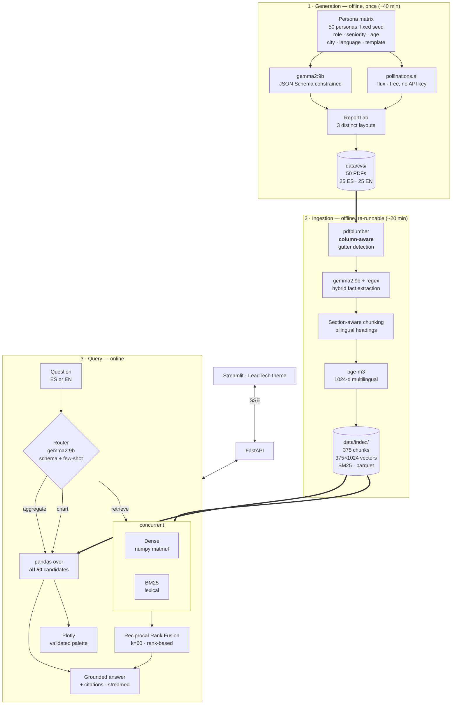

# Architecture

## The complete workflow

## Why the query layer is routed

A plain RAG pipeline retrieves the top *k* chunks and answers from them. That is
the right shape for "who has experience with Kubernetes?" and structurally wrong
for "how many candidates know Kubernetes?" — with `k=5`, the honest answer to a
counting question is unreachable no matter how good the retriever is.

So the router picks the machinery that can actually answer:

| Intent | Machinery | Example |
|---|---|---|
| `retrieve` | hybrid search → grounded generation | *¿Quién sabe aprendizaje automático?* |
| `aggregate` | pandas over the full candidate table | *How many candidates know Kubernetes?* → **exactly 13 of 50** |
| `chart` | same, plus a Plotly figure | *Histograma de las edades de los que sepan Python* |

## Why RRF, and not a weighted score blend

Measured on this corpus with `bge-m3`:

| Pair | Cosine |
|---|---|
| `"aprendizaje automático…"` ↔ `"machine learning…"` | **0.745** |
| Spanish question ↔ relevant English CV | **0.580** |
| Spanish question ↔ unrelated English text | **0.475** |

The signal is real, but the floor is high and the usable band is narrow — and
BM25 scores are unbounded and corpus-dependent. Mapping two distributions of
such different shape onto one scale means inventing constants that would not
survive a change of corpus.

Reciprocal Rank Fusion consumes only **ranks**:

$$\text{RRF}(d) = \sum_{r \in \{\text{dense},\ \text{bm25}\}} \frac{1}{k + \text{rank}_r(d)}$$

No thresholds, no normalisation, no tuning. Each retriever contributes what it
is good at: BM25 nails literal tokens (`UPC`, `PostgreSQL`, a surname), the
dense index crosses the language barrier.

## The integrity constraint

`data/profiles/*.json` holds the structured output the generator produced. The
ingestion pipeline **never reads it**. Everything — names, skills, ages,
employers — is re-derived from text pulled back out of the PDFs.

Without that rule the demo would be circular: it would prove the generator can
round-trip its own JSON, not that the system can read a CV. With it, the
pipeline treats each PDF as an opaque document, exactly as it would a résumé a
real candidate sent in.

## Design decisions

| Decision | Reason |
|---|---|
| **numpy, not a vector DB** | 375 vectors (chunks). Exact cosine is one matmul, sub-millisecond. An ANN index would be slower, approximate, and another dependency. |
| **gemma2:9b over gemma4:12b** | Profiled on this 8 GB RTX 4070: the 12B gets only 4.4 GB onto the GPU and runs the rest on CPU → 7.3 tok/s. The 9B fits → 18.3 tok/s, 2.5× faster at comparable quality. |
| **bge-m3 embeddings** | Genuinely multilingual, so one index serves both languages. A monolingual model would need either translation or two indexes. |
| **Constrained decoding** | Ollama enforces the JSON Schema, so no output parsing or JSON repair anywhere in the codebase. |
| **Few-shot in the router** | Schema guarantees shape, not meaning: zero-shot, gemma2 labelled the histogram request `retrieve`. The examples fixed it. |
| **ReportLab, not HTML→PDF** | Pure Python wheels. No Chrome, no GTK for a reviewer to install. |
| **Regex + LLM extraction** | E-mail, phone and date of birth have rigid surface forms; `re` solves them exactly and instantly. The LLM handles only what needs judgement. |
| **Concurrent route + embed** | Independent, and both models are resident in VRAM. Overlapping them halves time-to-first-token (~13 s → ~7 s). |

## Problems hit along the way

**Two-column extraction.** `pdfplumber` reads by vertical position across the
full page width, so the sidebar template came out interleaved — a phone number
landing mid-sentence in the professional summary. Fixed by detecting the
whitespace gutter empirically (scan x positions, keep those no word crosses,
require both sides to hold ≥12% of the words) and extracting each column
separately. Detecting it rather than hard-coding our own template's geometry
means it also works on a CV the pipeline did not generate.

**Silent glyph corruption.** ReportLab draws `Paragraph` bullets in the style's
`bulletFontName`, which defaults to Helvetica. "•" has no Helvetica mapping, so
every bullet extracted as `(cid:127)` — invisible in the rendered PDF, poisoning
every chunk and embedding downstream. Caught only by reading the extracted text.

**Latin-1 fonts.** ReportLab's built-in fonts cannot encode `ń`, and the corpus
contains *Katarzyna Wilczyńska*. Fixed by registering real TrueType families.
